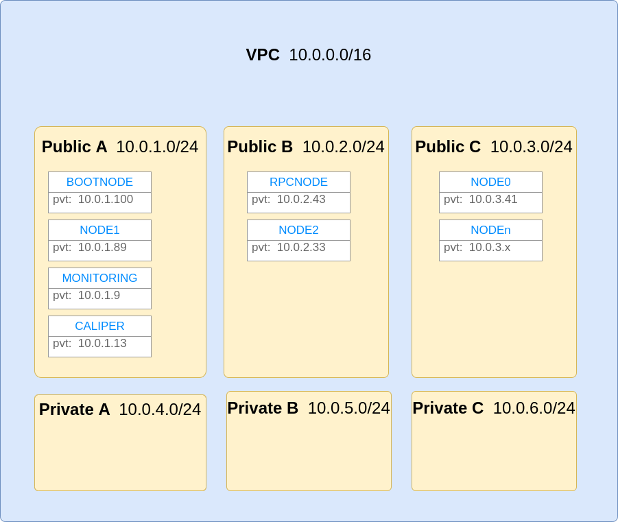

# Terraform

## Contents

This repo contains various scenarios that you can setup eg:
- spin up an ibft network with 4 validators and n listener nodes

You get the following per setup:
- monitoring node with prometheus, grafana with the Besu dashboard
- caliper node from which to run the tests from
- bootnode
- rpcnode
- n nodes 

Each node has ports 8545, 8546, 8547 open and ready for comms. Each node also has DNS enabled with the form:
`<node>-<idx>.<vpc-name>.<region>`
where:
idx is the node count, vpc-name & region are vars you define in the varaibles.tf file.
For example if vpcname=ibft4Caliper & region=ap-southeast-2 you would get the following:
```bash
bootnode.ibft4Caliper.ap-southeast-2
rpcnode..ibft4Caliper.ap-southeast-2
node-0.ibft4Caliper.ap-southeast-2
.
.
node-n.ibft4Caliper.ap-southeast-2
```
Additionally, the caliper node is set to use the rpcnode in networkconfig.json





## Usage

0. Ensure you have aws credentials setup and for the right account, eg: ENV_VARS override ~/.aws/credentials, refer to the precedence [here](https://docs.aws.amazon.com/cli/latest/userguide/cli-configure-envvars.html)
1. Install [terraform](https://learn.hashicorp.com/terraform/getting-started/install.html)
2. Run the scenario of choice:
```bash
cd ibftScale/ibft4Caliper

# update <project>/variables.tf to suit your needs
eg: update node_count, besu_version or provide a besu_download_url link if using a build from circleci

terraform init && terraform validate && terraform apply
```

3. Wait for the nodes to start

4. ssh into the caliper box and run
```bash
cd caliperProject && ./benchmark.sh
```
Reports and logs found under ./caliperProject

5. Destroy the env with 
```bash
terraform destroy
```
